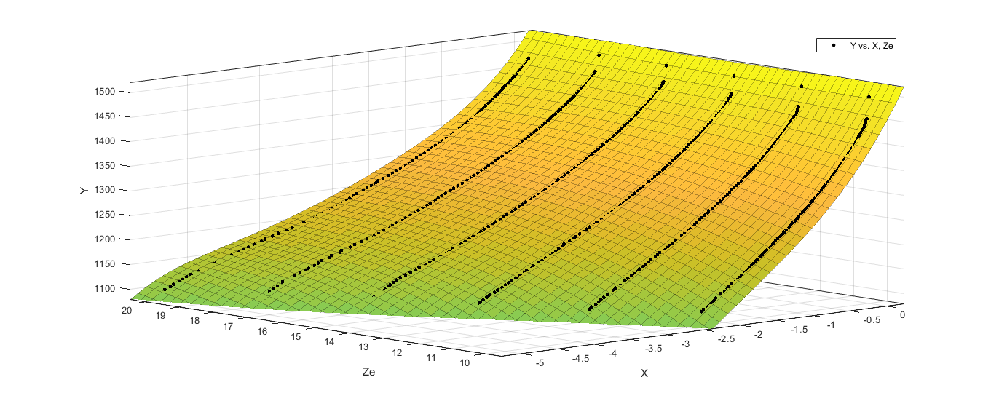
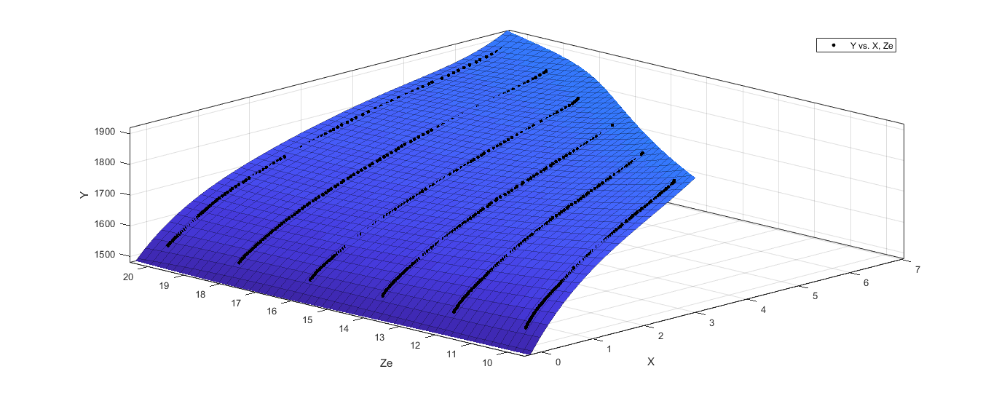

# AUVMEC
## Thruster Orientation for CW and CCW propellors
### Green: CCW , Blue: CW

## Curve Fitting equations for T200s
*Note: All forces are in Kgf*

#### Curve Fit - PWM(f) @12V
- Negative Half
`PWM(f) = 7.359 * (f^3) + 47.59 * (f^2) + 199.2 * (f) + 1461;`
- Positive Half
`PWM(f) = 3.771 * (f^3) - 31.19 * (f^2) + 159.9 * (f) + 1540;`
- Dead band
`1464 - 1532 => 0 Kgf Force`

#### Surface fit - PWM(f,V)
- Negative Half

` f(x,y) = 1278 + 109.7*x + 35.57*y + 15.03*x^2 + -15.48*x*y + -15.13*y^2 + 5.851*x^3 + -3.23*x^2*y + 6.245*x*y^2 + 0.3979*y^3 + 2.991*x^4 + -3.445*x^3*y + 0.205*x^2*y^2 + -1.823*x*y^3 + 1.233*x^5 + 1.296*x^4*y + 2.783*x^3*y^2 + 1.489*x^2*y^3 `    
    - *R-square: 0.9993*
    
- Positive Half
`  PWM(f,V) = 1682 + 301.9*f - 31.3*V - 93.2*(f^2) + 9.779*f*V + 2.132*(V^2) + 37.13*(f^3) - 4.207*(f^2)*V - 2.7*f*(V^2) - 0.04853*(V^3) - 1.475*(f^4) - 3.012*(f^3)*V + 1.006*(f^2)*(V^2) + 0.09237*f*(V^3) + 0.1227*(f^5) - 0.03288*(f^4)*V + 0.09417*(f^3)*(V^2) - 0.03484*(f^2)*(V^3) `
    - *R-square: 0.9986*
    
