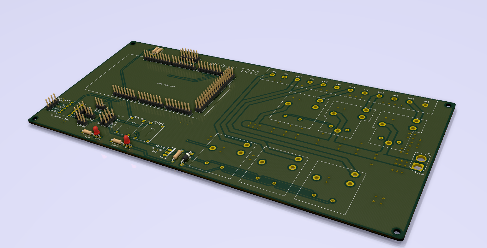

# AUVMEC
## Thruster Orientation for CW and CCW propellors
### Green: CCW , Blue: CW

## Curve Fitting equations for T200s
*Note: All forces are in Kgf*

#### Curve Fit - PWM(f) @12V
- Negative Half
`PWM(f) = 7.359 * (f^3) + 47.59 * (f^2) + 199.2 * (f) + 1461;`
- Positive Half
`PWM(f) = 3.771 * (f^3) - 31.19 * (f^2) + 159.9 * (f) + 1540;`
- Dead band
`1464 - 1532 => 0 Kgf Force`

### PCB Sheild designed for power deliver and control signal routing

